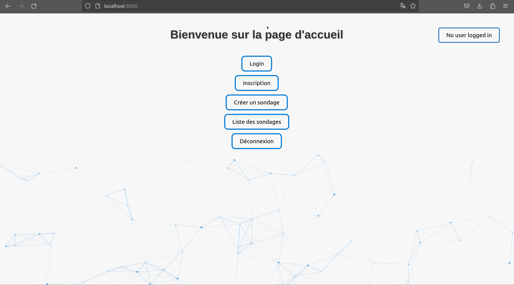

# Squelette d'application : Sondage

Ce site a été créé afin de prendre en main les différentes technologies qu'il constitue. Parmis celles-ci: HTML / CSS / JS et GoLang. 
L'objectif était également de pouvoir prendre en main différentes libraires en GoLang parmis les plus importantes:
- database/sql
- net/http
- github.com/gorilla/websocket
- html/template
- github.com/gorilla/sessions

## Le site Sondage

Le développement de ce site fut très intéressant, voila une liste des principales fonctionnalités contenus dans celui-ci:

__Possibilité de créer des sondages__: Cette fonctionnalité nous a permis d'étendre l'utilsation de la lib html/template via l'utilisation de boucle/condition dans les fichiers html ainsi que l'envoi d'information aux fichiers html.

__Résultats des sondages en temps réel__: Ici la lib websocket de gorilla a été utilisée, les utilisateurs n'ont donc pas la nécéssité de rafraichir la page lorsqu'un nouvel utilisateur vote au sondage car celle-ci s'actualise en temps réel.

__Système de récupération de mot de passe__: Une autre tâche intéressante contenu dans le site est la possibilité de récupérer son mot de passe à l'aide de l'adresse email renseignée lors de son inscription sur le site internet.

__Expiration des sondages__: L'utilisation de TIMESTAMP dans nos tables de la base de données PostgreSQL nous a permis de créer un système d'expiration de sondage afin d'avoir une liste de sondage récent.

__Session d'utilisateur__: Un système de session a été inclus dans le site evitant aux utilisateurs de se reconnecter à chaque rafraichissement de la page internet.

## Architecture du site

Le site est constitué de différentes pages:

- "/" Page d'acceuil contenant la navigation entre les différentes pages
- "/signup" Pour créer un utilisateur
- "/login" Pour se connecter à son compte
- "/create_sondage" Pour pouvoir créer un sondage
- "/sondage_list" Pour pouvoir voir la liste des différents sondages créés
- "/sondage/?" Page pour voter a un sondage chaque sondage à son propre ID sur l'URL
- "/sondage_results/?" Page pour voir les résultats d'un sondage, chaque sondage à son propre ID sur l'URL

## Exécuter le programme

Tout d'abord pour pouvoir lancer le site en local il va falloir installer les différentes librairies contenus dans le projet via la commande `go mod tidy`.

### Création de la base de donnée 

Ensuite il faudra alors créer une "copie" de la base de donnée utiliser, il faut alors installer PostgreSQL puis exécuter les commandes suivantes:

`sudo -u postgres psql` 
`CREATE USER sondage WITH PASSWORD bood7Ees;` 
`ALTER USER sondage SUPERUSER;` 
`CREATE DATABASE sondage_db OWNER sondage;` 
`\q` 
`sudo -u postgres psql sondage_db` 
`CREATE TABLE users (id SERIAL PRIMARY KEY, username VARCHAR(50), password VARCHAR(100), mail_address VARCHAR(100));` 
`CREATE TABLE sondages (id SERIAL PRIMARY KEY, titre VARCHAR(100), description TEXT, choix1 VARCHAR(100), choix2 VARCHAR(100), choix3 VARCHAR(100), choix4 VARCHAR(100), date_creation TIMESTAMP, date_expiration TIMESTAMP, nb_choices INT, createur_id INT, FOREIGN KEY (createur_id) REFERENCES users(id));`

### Lancer le site

Pour faire tourner le programme il suffit de lancer la commande `run *.go` en étant dans le dossier src. On peut alors se connecter au site via l'adresse localhost (ou adresse IP hebergeant le programme) sur le port 8080
(http://localhost:8080/)